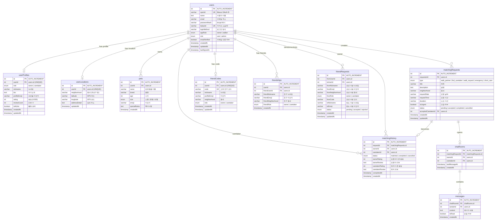

# 반려이음 데이터베이스 ERD 설계

**프로젝트명:** 반려이음 (대전 반려동물 돌봄 매칭 앱)
**DBMS:** MySQL 8.0
**ORM:** Drizzle ORM

---

## ERD 다이어그램

---

## 1. 테이블 구조 및 관계

반려이음 앱의 데이터베이스는 총 11개 테이블로 구성되며, 사용자 인증, 프로필 관리, 매칭, 채팅, 친구, 위치 추적의 6개 도메인으로 분류됩니다.

### 1.1 테이블 요약

| 테이블명 | 도메인 | 설명 | 주요 관계 |
|---|---|---|---|
| `users` | 인증 | 사용자 계정 (이메일/카카오) | 모든 테이블의 기준 |
| `userProfiles` | 프로필 | 보호자/도그워커 프로필 | users 1:1 |
| `userLocations` | 위치 | 사용자 거주 위치 (대전 구/동) | users 1:1 |
| `pets` | 프로필 | 반려동물 정보 | users 1:N |
| `matchingRequests` | 매칭 | 돌봄/산책 요청 | users N:1 |
| `matchingHistory` | 매칭 | 매칭 이력 및 상호 평가 | matchingRequests 1:1 |
| `chatRooms` | 채팅 | 매칭된 사용자 간 채팅방 | matchingRequests 1:1 |
| `messages` | 채팅 | 채팅 메시지 | chatRooms 1:N |
| `friendCodes` | 친구 | 사용자별 고유 친구 코드 | users 1:1 |
| `friendships` | 친구 | 양방향 친구 관계 | users N:N |
| `friendRequests` | 친구 | 친구 요청 (대기/수락/거절) | users N:N |

### 1.2 핵심 관계 설명

**users ↔ userProfiles (1:1):** 모든 사용자는 하나의 프로필을 가집니다. `userProfiles.userId`는 UNIQUE 제약으로 1:1 관계를 보장합니다. 프로필에는 역할(보호자/도그워커), 닉네임, 평점 등이 저장됩니다.

**users ↔ pets (1:N):** 보호자는 여러 마리의 반려동물을 등록할 수 있습니다. 각 반려동물에는 품종, 나이, 크기, 건강 특이사항이 기록됩니다.

**users ↔ matchingRequests (1:N):** 보호자가 생성하는 돌봄/산책 요청입니다. 요청 유형(산책 친구, 돌보미 찾기, 긴급 돌봄 등), 동네, 날짜/시간, 긴급 여부가 포함됩니다. `acceptedCaretakerId`는 요청을 수락한 도그워커를 참조합니다.

**matchingRequests ↔ matchingHistory (1:1):** 매칭이 성사되면 이력이 생성됩니다. 서비스 완료 후 보호자와 도그워커가 서로 평점과 리뷰를 남깁니다.

**matchingRequests ↔ chatRooms (1:1):** 매칭된 보호자와 도그워커 간 채팅방이 자동 생성됩니다. 예약 전 세부 사항 조율에 사용됩니다.

**users ↔ friendships (N:N):** 친구 관계는 양방향으로 저장됩니다. A가 B와 친구가 되면, A→B와 B→A 두 개의 레코드가 생성됩니다.

**users ↔ friendRequests (N:N):** 친구 요청은 단방향입니다. 요청자(fromUserId)가 수신자(toUserId)에게 보내며, 상태(pending/accepted/rejected)로 관리됩니다.

---

## 2. 인덱스 전략

| 테이블 | 인덱스 | 타입 | 용도 |
|---|---|---|---|
| `users` | `openId` | UNIQUE | OAuth 로그인 조회 |
| `users` | `email` | INDEX | 이메일 로그인 조회 |
| `users` | `kakaoId` | UNIQUE | 카카오 로그인 조회 |
| `userProfiles` | `userId` | UNIQUE | 프로필 조회 |
| `userLocations` | `userId` | UNIQUE | 위치 조회 |
| `matchingRequests` | `requesterId` | INDEX | 사용자별 요청 목록 |
| `matchingRequests` | `neighborhood` | INDEX | 동네별 요청 검색 |
| `friendCodes` | `code` | UNIQUE | 친구 코드 검색 |
| `friendships` | `userId` | INDEX | 친구 목록 조회 |
| `messages` | `chatRoomId` | INDEX | 채팅방별 메시지 조회 |

---

## 3. 데이터 무결성 규칙

모든 외래 키 관계에서 참조 무결성을 보장하며, 다음과 같은 규칙을 적용합니다.

| 규칙 | 적용 대상 | 동작 |
|---|---|---|
| CASCADE DELETE | `messages` → `chatRooms` | 채팅방 삭제 시 메시지도 삭제 |
| SET NULL | `matchingRequests.acceptedCaretakerId` | 도그워커 탈퇴 시 NULL 처리 |
| RESTRICT | `users` → `matchingHistory` | 진행 중인 매칭이 있으면 탈퇴 불가 |
| CASCADE DELETE | `friendships` → `users` | 사용자 탈퇴 시 친구 관계 삭제 |
